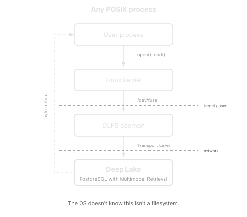

# Memory CP

**An MCP server that lets users orchestrate multiple [OpenClaw](https://openclaw.com) AI agents that share persistent memory via [Deep Lake](https://deeplake.ai).**

## How it works

```
                        ┌─────────┐
                        │  User   │
                        └────┬────┘
                             │  MCP protocol
                      ┌──────┴───────┐
                      │  Memory CP   │  
                      │  (MCP Server)│
                      └──────┬───────┘
                             │
            ┌────────────────┼────────────────┐
            │                │                │
     ┌──────┴───────┐  ┌─────┴────────┐ ┌─────┴────────┐
     │  OpenClaw #1 │  │  OpenClaw #2 │ │  OpenClaw #N │
     │  (AI Agent)  │  │  (AI Agent)  │ │  (AI Agent)  │
     └──────┬───────┘  └──────┬───────┘ └─────┬────────┘
            │                 │               │
            └─────────────────┼───────────────┘
                              │  read / write
                    ┌─────────┴─────────┐
                    │                   │  
                    │     Deep Lake     │  ← shared memory synced in real-time   
                    │                   │
                    └───────────────────┘
```

The user interacts with **Memory CP** through any MCP-compatible client (ChatGPT, Claude, etc.). Memory CP dispatches tasks to **N OpenClaw agents** — autonomous AI coding agents that can work in parallel. All agents share the same persistent filesystem powered by **Deep Lake CLI**, so anything one agent writes is instantly visible to all the others.

## Deep Lake: the shared memory layer

[Deep Lake CLI](https://deeplake.ai) mounts a database-backed filesystem via FUSE. To agents and tools it looks like a normal directory — but every file operation (`open`, `read`, `write`, `rename`) maps to a transaction against Deep Lake Serverless Postgres. There is no sync daemon and no local copy that can drift: **the database is truth, POSIX is the interface**.

| POSIX operation | What happens |
|---|---|
| `cat file.md` | `SELECT content FROM deeplake_memory WHERE path = $1` |
| `echo "..." > file.md` | `INSERT ... ON CONFLICT UPDATE` |
| `mv old new` | `UPDATE SET path = ... WHERE path = ...` (atomic) |
| `rm file.md` | `DELETE FROM deeplake_memory WHERE path = $1` |

Files are **not stored locally**. The local mount point is a virtualization — a FUSE layer that intercepts Linux kernel syscalls and translates them into API calls to the Deep Lake server. Agents and tools interact with the filesystem as if files were on disk, but nothing is on disk:



### Install Deep Lake CLI

```bash
curl -fsSL https://www.deeplake.ai/install | bash
```

Then initialize and mount — `deeplake init` handles authentication, workspace selection, table creation, and mounting in one interactive command:

```bash
deeplake init
```

Once done, the mount is live. Point `DEEPLAKE_MOUNT` in your `.env` to the chosen path and Memory CP will use it as shared memory for all agents.

Multiple agents (or devices) can mount the same Deep Lake workspace simultaneously — one writes, all others see the change instantly.

### Retrieval: BM25, semantic similarity, and beyond

Search goes beyond `grep`. Because every file lives in a Deep Lake table, retrieval runs as SQL queries directly against the server:

- **BM25 (keyword)** — fast full-text search, no tree-walk needed
- **Vector similarity (semantic)** — finds files by meaning, even when phrased differently

```sql
-- BM25 keyword search
SELECT path, content_text <#> 'authentication error' AS score
FROM deeplake_memory
ORDER BY content_text <#> 'authentication error'
LIMIT 10;
```

In the future, Deep Lake will also embed images and other media, enabling **cross-modal retrieval** (e.g. text-to-image search) over the same mounted namespace — no interface changes required.

## MCP Tools

| Tool | Description |
|------|-------------|
| `list-agents` | List all connected OpenClaw agents and their online/offline status |
| `send-task` | Dispatch a task to a specific OpenClaw agent (it can read/write shared memory) |
| `list-files` | Browse files in the shared Deep Lake filesystem |
| `read-file` | Read a file from shared memory |
| `write-file` | Write a file to shared memory (instantly visible to all agents) |
| `search-memory` | Full-text search across all memories via Deep Lake SQL API |

## Getting Started

### 1. Install dependencies

```bash
npm install
```

### 2. Configure environment

Create a `.env` file:

```env
# OpenClaw agents (JSON array of {id, url, token, name})
OPENCLAW_SERVERS='[{"id":"agent-1","url":"https://your-openclaw.com","token":"...","name":"Coder"}]'

# Optional: secure the MCP endpoint with a Bearer token
MCP_API_KEY=your-secret-key

# Deep Lake mount path (defaults to ./1)
DEEPLAKE_MOUNT=/path/to/deeplake/mount
```

Deep Lake credentials are loaded automatically from `~/.deeplake/credentials.json` and `~/.deeplake/mounts.json` (created by the Deep Lake CLI).

### 3. Run the server

```bash
npm run dev
```

Open [http://localhost:3000/inspector](http://localhost:3000/inspector) to test your tools interactively.

## Deploy

```bash
npm run deploy
```

Deploys to [Manufact Cloud](https://manufact.com).

## Built with

- [mcp-use](https://mcp-use.com) — MCP server framework
- [OpenClaw](https://openclaw.com) — autonomous AI agents
- [Deep Lake](https://deeplake.ai) — cloud-native virtual filesystem for AI agents
